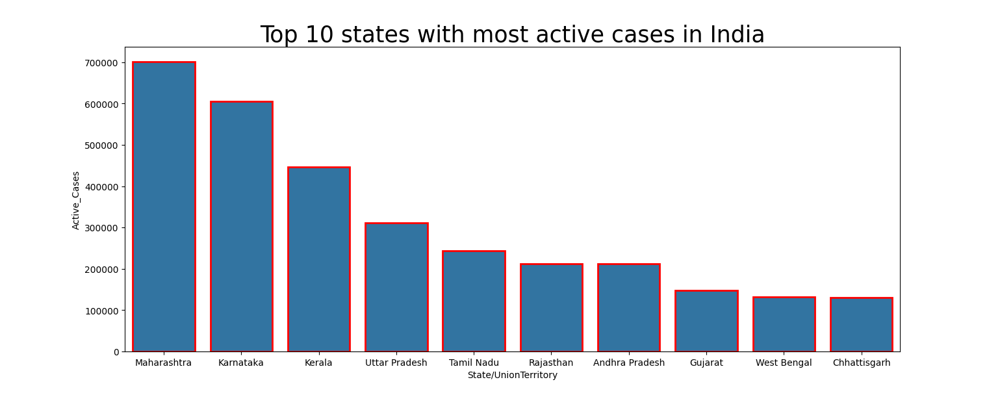

# Den-Guard

## About The Project

Den-Guard is a web-based platform designed to visualize and analyze the spread of dengue fever across India. This innovative tool aims to provide comprehensive insights into dengue cases by gender, age, and other relevant factors, alongside showcasing vaccination records.

 *Image description: An interactive heatmap representing dengue fever spread across different regions of India.*

## Features

- **Interactive Data Visualization:** Utilize temporal trends and regional heatmaps to understand the dynamics of dengue spread.
- **Customizable Filters:** Explore data based on specific criteria such as gender, age groups, and more.
- **Vaccination Records:** Access detailed records of paid and unpaid vaccinations to assess their impact on dengue prevention.

## Built With

- **Python:** For backend data analysis and server-side logic.
- **HTML/CSS/JavaScript:** For a dynamic and responsive user interface.
- **Data Visualization Libraries:** To create interactive charts and maps.

## Getting Started

To get a local copy up and running follow these simple steps:

1. Clone the repo
   ```sh
   git clone https://github.com/yourusername/den-guard.git
   ```
2. Install required Python packages
   ```sh
   pip install -r requirements.txt
   ```

## Usage

Navigate to the project directory and run the application:

```sh
python app.py
```

Open your web browser and visit `http://localhost:5000` to explore the platform.

## Project Details

- **Objective:** Provide an accessible platform for analyzing dengue fever and vaccination efforts in India.
- **Key Features:** Interactive visualizations, customizable data filtering, and comprehensive vaccination records.
- **Expected Outcome:** An informative platform offering insights into dengue trends and vaccination coverage, enhancing public awareness and supporting evidence-based decision-making.

## Python Concepts Utilized

- Web Development
- Data Analysis
- Data Retrieval
- User Interface Design
- Algorithms
- File Handling
- Data Visualization
